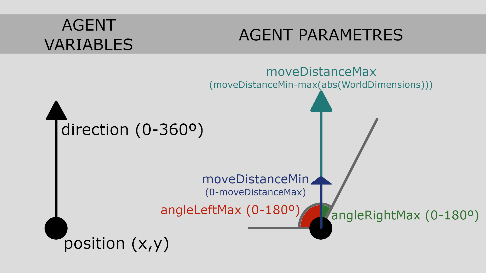

## class `Walker`
The class includes methods for random walk (that could be extended with other walking methods). This is directly applicable to object-oriented implementations (e.g., Python), but could be adapted to build equivalent versions in other types of languages. 

- `MoveRandom(angleLeftMax, angleRightMax, moveDistanceMin, moveDistanceMax, worldDimensions)`: 2D random walk with parameters for direction and distance variation and limited to given world dimensions. Uses uniform distributions for random values. Sets Walker instance new position and returns new x, y, and direction in degrees.
- `MoveRandomFree(angleLeftMax, angleRightMax, moveDistanceMin, moveDistanceMax)`: 2D random walk with parameters for direction and distance variation. Uses uniform distributions for random values. Returns new x, y, and direction in degrees.
- `GetRandomRotation(currentDirection, angleLeftMax, angleRightMax)`: Rotate initial direction randomly within the range `(currentDirection - angleLeftMax, currentDirection + angleRightMax)`. Uses uniform distributions for random values. Returns new direction in degrees.
- `IsOutsideWorld(self, x, y, worldDimensions)`: Checks if the coordinates are outside the world dimensions. Returns Boolean (true/false). 
- Static methods for testing instance methods. Testing is limited here to printing result in a more readable manner. 

