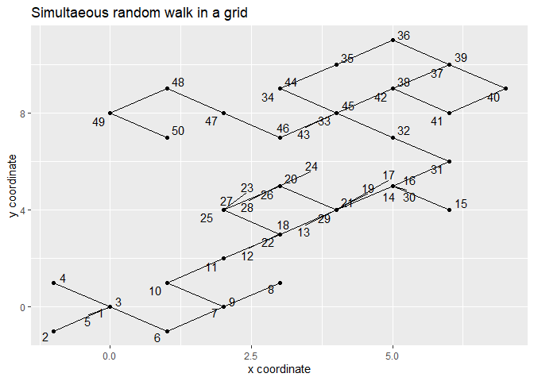
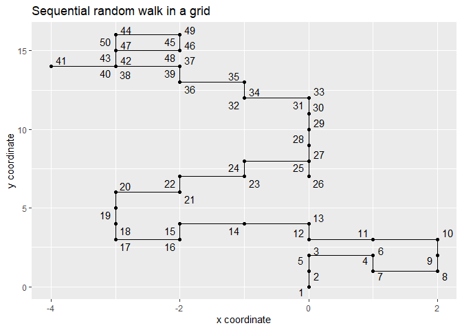
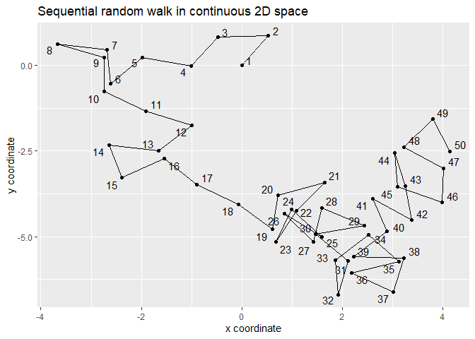

Random walk in data frames
# R documentation
## Table of contents

- [`designDetails.md`](designDetails.md) : free format document describing the module process, beyond the level of implementation.
  
- [Code and demostration in Rmarkdown](htmlpreview.github.io/?https://github.com/Archaeology-ABM/NASSA-modules/blob/main/2021-Galan-001/2D-Random-walk.html)
  
- Output examples:

|     |
| --- |
|  |
|  | 
|  |
